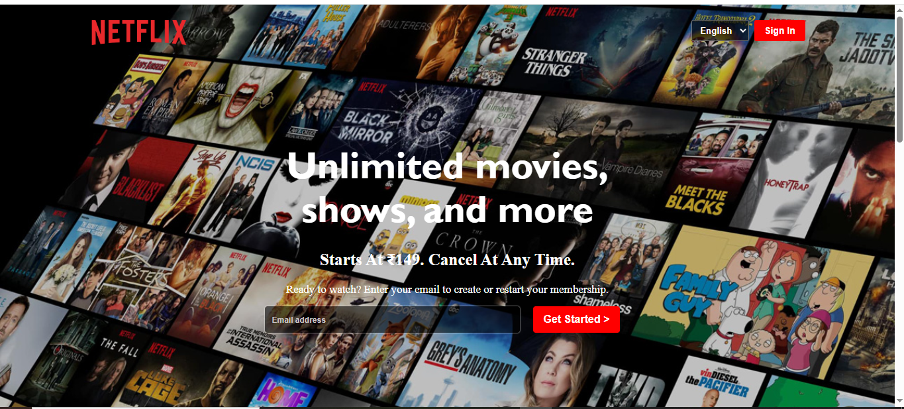
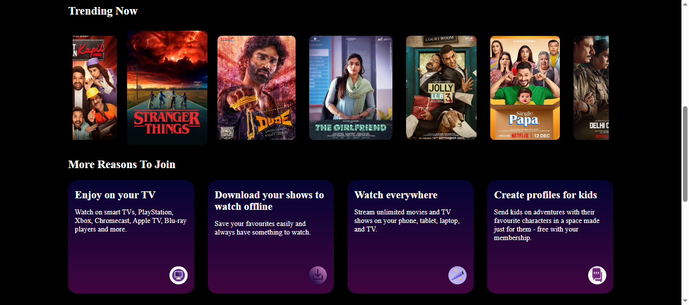

# 🎬 Netflix Clone

## 📌 Project Overview  
A simple Netflix landing page clone built using HTML and CSS. This project recreates the basic design and layout of Netflix's homepage for frontend practice.

## 🚀 Features  
- Netflix-style hero section  
- Language selector  
- Sign In button  
- Email signup form  
- Trending movies section  
- Feature cards section  
- Hover effects on movie posters  

## 🛠️ Technologies Used  
- HTML5  
- CSS3  

## 📁 Project Structure  

netflix-clone/  
│  
├── index.html  
├── netflix.css  
├── images/  
└── README.md  

## 📸 Screenshot  

### Home Page

### Movies Section

## ▶️ How to Run  
1. Download or clone the repository  
2. Open index.html in a browser  
3. Explore the Netflix Clone page  

## 🎯 What I Learned  
- Flexbox layouts  
- Background images  
- Hover effects  
- Horizontal scrolling sections  
- Responsive design concepts  

## 👤 Author  
Brindhadevi S