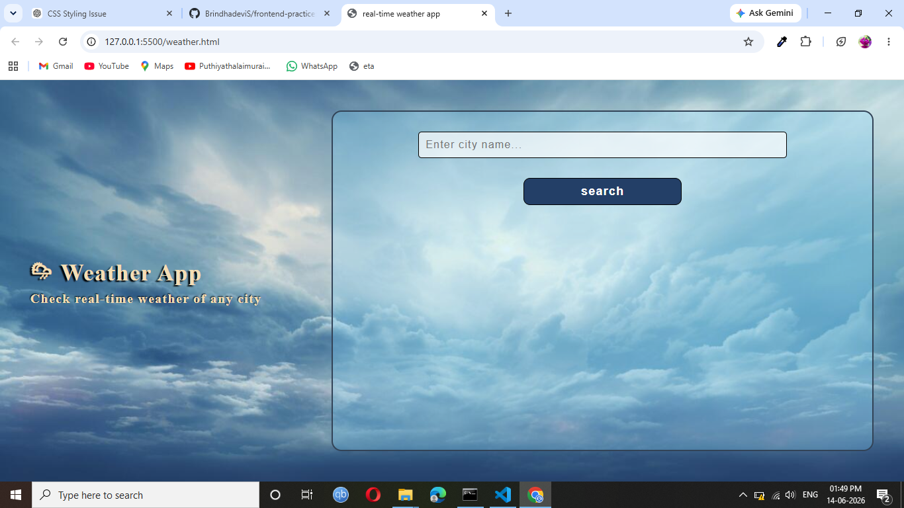
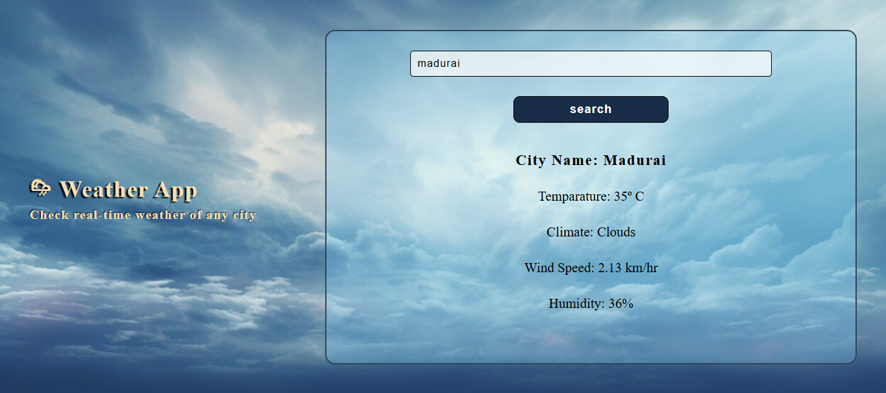

# 🌦️ Weather App  

## Description 
A simple Weather App built using HTML, CSS, and JavaScript that allows users to check real-time weather information for any city.

## Features
- Search weather by city name  
- Display temperature  
- Show weather condition  
- Display humidity  
- Display wind speed  
- Responsive user interface  

## Technologies Used  
- HTML5  
- CSS3  
- JavaScript  
- Weather API  

## Project structure 

weather-app/  
│  
├── weather.html   
├── weather.js   
├── images/    
│   ├── background.jpg  
├── screenshots/   
│   ├── home-page.png    
│   └── weather-result.png    
└── README.md    

## Installation & Usage  
1. Clone the repository.
2. Open the project folder.
3. Open `weather.html` in your browser.
4. Enter a city name.
5. Click the Search button to view weather details.

## 📸 Screenshots

### Home Page

### Weather Result

---
## 👩‍💻 Author
**Brindhadevi S**

